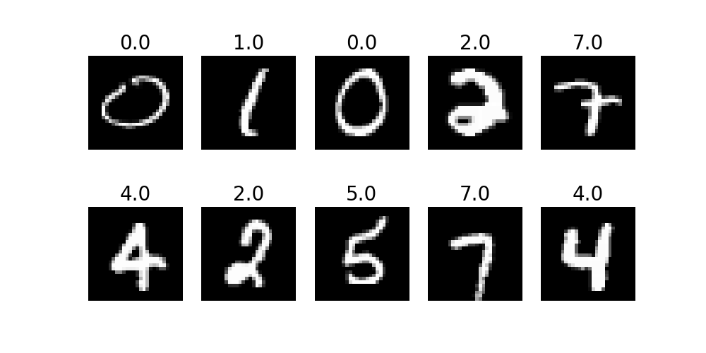
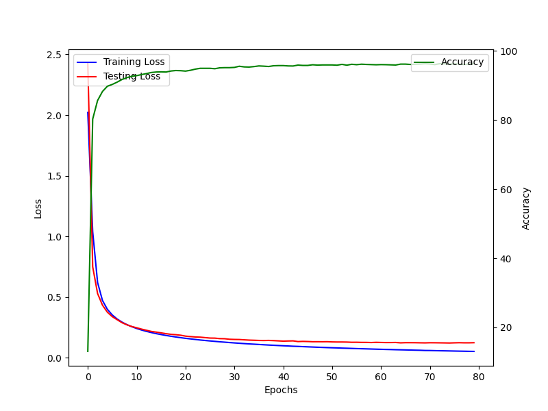
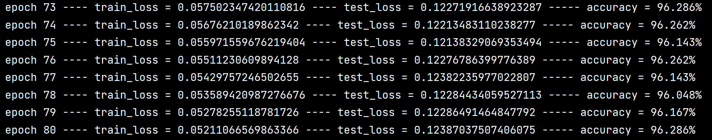

# NumPy-Only Neural Network Implementation

## Description
This project demonstrates how to implement and train a neural network from scratch using Numpy.
The model was trained to classify handwritten digits from the MNIST dataset, achieving an impressive accuracy of ~96%.
The implementation includes core components of neural networks, such as dense layers, activation functions,
loss functions, and backpropagation, providing a hands-on understanding of how neural networks work.

This project includes:
- **Dense Layers**: Fully connected layers with customizable weights and biases.
- **Activation Functions**: Sigmoid for hidden layers and Softmax for output layer.
- **Loss Function**: Cross-entropy loss for multi-class classification.
- **Backpropagation**: Stochastic gradient descent (SGD) optimization with mini-batches.

## Features
- **Pure NumPy Implementation**: No deep learning frameworks are used.
- **MNIST Dataset**: Includes functions to load and preprocess the MNIST dataset.

## Installation
To use this project, you need to have Python and NumPy installed. You also need matplotlib for visualization.

## Training and Testing on MNIST Dataset

Sample test results:

Training and testing losses with accuracy on validation dataset:

Training logs:

